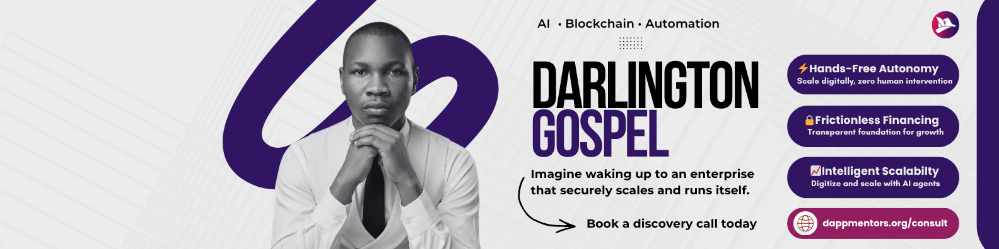

<h1 align="center">Hi 👋, I'm Darlington Gospel</h1>
<h3 align="center">I design AI-powered, blockchain-secured, fully autonomous systems that run businesses at enterprise scale — zero human intervention, on-chain trust, and real revenue impact.</h3>

<!-- Social icons section -->

  
  &#8287;&#8287;&#8287;&#8287;&#8287;
  
  &#8287;&#8287;&#8287;&#8287;&#8287;
  
  &#8287;&#8287;&#8287;&#8287;&#8287;
  
  &#8287;&#8287;&#8287;&#8287;&#8287;
  

- 🚀 **Founder & CEO of Dapp Mentors** — Architecting the next generation of autonomous infrastructure for pharma retail, ride-sharing, REITs, fintech, and beyond
- 🔧 Specializing in **AI + Blockchain + Automation** systems: AI agents executing Nasdaq-scale trades, on-chain settlements in <3 seconds, 99.95% uptime platforms with zero trust gaps
- 👨‍💻 9+ years engineering scalable systems, laser-focused on AI/Blockchain convergence since 2020
- 📝 Creator of 40+ in-depth articles, premium courses, system blueprints, and technical content that turns complex infrastructure into actionable reality
- 💻 Core stack: JavaScript, Redux, React, React Native, Next.js, Node.js, Python, Solidity, PHP, APIs — plus modern AI tooling for RAG pipelines and autonomous agents
- 🎥 Running **Dapp Mentors** on YouTube with real-world architecture breakdowns that are inspiring founders and developers to build the future
- 🎧 Music, songwriting, and food experiments keep the creativity flowing — because the best systems are built by well-fueled minds
- 📫 **Open for high-impact collaborations**: Book a discovery call to design your autonomous infrastructure → [dappmentors.org/consult](https://dappmentors.org/consult)

### YouTube videos
<!-- YOUTUBE:START -->

<a href="https://www.youtube.com/watch?v=0ONcQtFAO0g">
What It Takes to Build a 500-Branch Autonomous Pharma Retail Chain | Ep 05
</a>

<a href="https://www.youtube.com/watch?v=QtkjyenWmu8">
How I Would Modernize Ride-Share with AI, Blockchain &amp; Automation | Ep 04
</a>

<a href="https://www.youtube.com/watch?v=qeYUQKP29QE">
Agentic AI Agents Now Execute On-Chain Trades at Nasdaq Scale | Ep 03
</a>

<a href="https://www.youtube.com/watch?v=L7RjU09dvj0">
How I would Design an Autonomous REIT that Pays Monthly Dividends | Ep 02
</a>

<a href="https://www.youtube.com/watch?v=JsMDYyab62E">
How I Would Modernize the Pharmaceutical Retail Chain with AI, Blockchain &amp; Automation | Ep 01
</a>

<!-- YOUTUBE:END -->

### Blogs posts
<!-- BLOG-POST-LIST:START -->
- [How I Would Modernize Ride-Share with AI, Blockchain &amp; Automation](https://dev.to/daltonic/how-i-would-modernize-ride-share-with-ai-blockchain-automation-42j4)
- [How I Would Design an Autonomous REIT that Pays Monthly Dividends](https://dev.to/daltonic/how-i-would-design-an-autonomous-reit-that-pays-monthly-dividends-3ngg)
- [How I Would Build an Autonomous Pharmaceutical Retail Chain Operating System](https://dev.to/daltonic/how-i-would-build-an-autonomous-pharmaceutical-retail-chain-operating-system-5be5)
- [What You Need to Build an Automated AI Crypto Trading Bot](https://dev.to/daltonic/what-you-need-to-build-an-automated-ai-crypto-trading-bot-47fa)
- [Build a Web3 Movie Streaming dApp using NextJs, Tailwind, and Sia Renterd: Part Three](https://dev.to/daltonic/build-a-web3-movie-streaming-dapp-using-nextjs-tailwind-and-sia-renterd-part-three-38ei)
<!-- BLOG-POST-LIST:END -->

<h3 align="left">Languages and Tools:</h3>

 
 
 
 
 
 
 
 
 

&nbsp;

