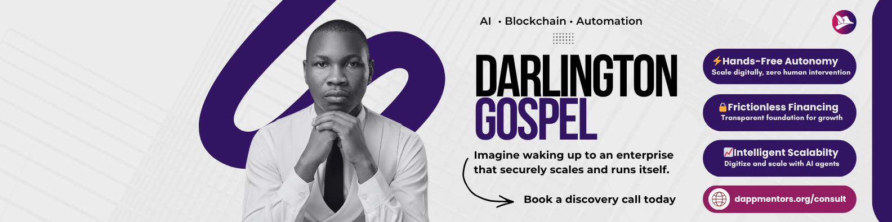

<h1 align="center">Darlington Gospel</h1>

  <strong>AI · Blockchain · Frontend · Teaching</strong> 
  I ship the system, then teach other people how to ship theirs.

  
  
  

  
  
  
  
  

<!-- Social icons section -->

  
  &#8287;&#8287;&#8287;&#8287;&#8287;
  
  &#8287;&#8287;&#8287;&#8287;&#8287;
  
  &#8287;&#8287;&#8287;&#8287;&#8287;
  
  &#8287;&#8287;&#8287;&#8287;&#8287;
  
  &#8287;&#8287;&#8287;&#8287;&#8287;
  
  &#8287;&#8287;&#8287;&#8287;&#8287;
  

---

### Who I am

Port Harcourt based. Remote by default. I run **Dapp Mentors** — a school and a product studio in the same house. Ten years in production software. Since 2020 the work has been AI, blockchain, and the interfaces that make both usable.

I write the code, put it on a public network or a real server, then turn that path into courses and YouTube videos so other builders are not stuck on half-finished tutorials.

| Focus | What that means in practice |
| --- | --- |
| **Applied AI** | RAG, agents, LLM judges, Whisper/Ollama pipelines, bots on Discord and Telegram |
| **Blockchain** | Solidity, Anchor/Rust, ERC + SPL tokens, wallets, gas, tests, mainnet deploys |
| **Frontend** | React, Next.js, TypeScript, streaming UIs, data-heavy dashboards |
| **Teaching / DevRel** | 5,800+ subscribers, 140+ tutorials, 10 paid courses, grants from DFINITY and Sia |

**Open for** full-time, contract, or consult work in those four seats. Prefer teams that care about shipping over slide decks.

  
  

---

### Selected systems

Built by me, not only taught by me. Detail and stack notes sit on the [portfolio](https://portfolio.dappmentors.org).

| Project | Year | Snapshot |
| --- | --- | --- |
| [**OpenBench**](https://portfolio.dappmentors.org) | 2026 | AI dataset curation. Multi-stage pipeline, CrewAI probes, LLM judge, artifacts on Sia |
| [**Rebit**](https://portfolio.dappmentors.org) | 2026 | Self-hostable video engine. Long form → short verticals with Whisper + Ollama, no cloud AI API |
| [**RumbleCourt**](https://portfolio.dappmentors.org) | 2026 | Live multi-agent debate. Streaming advocates, judge, on-chain record |
| [**Dapp Mentors**](https://dappmentors.org) | 2022–now | School platform: catalogs, enrollment, payments, progress |
| [**Timeless NFT**](https://github.com/Daltonic/timelessNFT) | 2022 | ERC-721/1155 marketplace, auctions, royalties, IPFS |
| [**Adulam NFT**](https://github.com/Daltonic/adulamNFT) | 2022 | Stage-based minting, whitelist, airdrop |
| [**Fundus**](https://github.com/Daltonic/fundus) | 2023 | Crowdfunding on Solana with Anchor |
| [**Sia Vid TV**](https://github.com/Daltonic/sia_vid_tv) | 2023 | Media app that stores and streams on Sia |

---

### Stack

Grouped the way I actually hire myself into projects — not a random icon dump.

**Languages**

  
  
  
  
  

**Frontend**

  
  
  
  

**AI**

  
  
  
  
  

**Blockchain & backend**

  
  
  
  
  
  

---

### YouTube videos
<!-- YOUTUBE:START -->

<a href="https://www.youtube.com/watch?v=-jp8i0oOXqk">
The Enterprise AI Race Has Shifted to Orchestration & Attestation | Ep 10
</a>

<a href="https://www.youtube.com/watch?v=c72EhAT_3uU">
How I Would Build an AI-Powered Operating System for Multi-Branch Businesses | Ep 09
</a>

<a href="https://www.youtube.com/watch?v=m5K4qDl7T8M">
How I Would Automate Traditional Business Operations with AI, Blockchain & Automation | Ep 08
</a>

<a href="https://www.youtube.com/watch?v=VPg6Qw_AHs8">
How I Would Automate Venture Capital with AI, Blockchain & Automation | Ep 07
</a>

<a href="https://www.youtube.com/watch?v=O_3nhmIux28">
The Assistive Era is Dead: Rebuilding Stacks for Autonomous AI Agents | Ep 06
</a>

<!-- YOUTUBE:END -->

  

### Writing
<!-- BLOG-POST-LIST:START -->
- [What It Actually Costs to Run an Autonomous Pharmaceutical Chain on a 5-Branch Pilot](https://dev.to/daltonic/what-it-actually-costs-to-run-an-autonomous-pharmaceutical-chain-on-a-5-branch-pilot-eo6)
- [How I Would Modernize Ride-Share with AI, Blockchain &amp; Automation](https://dev.to/daltonic/how-i-would-modernize-ride-share-with-ai-blockchain-automation-42j4)
- [How I Would Design an Autonomous REIT that Pays Monthly Dividends](https://dev.to/daltonic/how-i-would-design-an-autonomous-reit-that-pays-monthly-dividends-3ngg)
- [How I Would Build an Autonomous Pharmaceutical Retail Chain Operating System](https://dev.to/daltonic/how-i-would-build-an-autonomous-pharmaceutical-retail-chain-operating-system-5be5)
- [What You Need to Build an Automated AI Crypto Trading Bot](https://dev.to/daltonic/what-you-need-to-build-an-automated-ai-crypto-trading-bot-47fa)
<!-- BLOG-POST-LIST:END -->

Also publish on [Medium](https://medium.com/@darlingtongospel) and [HackerNoon](https://hackernoon.com/u/daltonic).

---

### GitHub pulse

  
  

  

---

  <strong>Build it. Then teach it.</strong> 
  That loop is the whole practice.  
  <a href="https://portfolio.dappmentors.org">Portfolio</a>
  ·
  <a href="https://dappmentors.org/consult">Consult</a>
  ·
  <a href="mailto:darlingtongospel@gmail.com">Email</a>
  ·
  <a href="https://www.linkedin.com/in/darlington-gospel/">LinkedIn</a>

